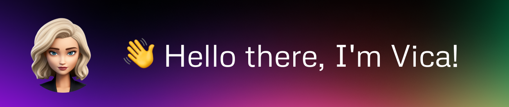

<!-- Welcome Section -->

  

<!-- Portafolio

  

 -->

  🚀 Welcome to my coding universe! As a passionate coder and student at 42 Madrid, I'm thrilled to share my latest projects and creations with you.

<!-- About Me Section -->
## 💬 About Me

- 🎓 Currently studying at 42 Madrid, diving deep into the world of coding.
- 📍 Part of H.E.R DAO Spain
- 💻 A collection of diverse projects awaits you, ranging from simple scripts to intricate applications, showcasing my skills across multiple languages and tools.
- 📚 Some projects come with detailed documentation, making them accessible and inviting for fellow developers.
- 🌍 Join me in exploring the endless possibilities of coding, and let's create something amazing together.

<!-- GitHub Stats Section -->
## 📊 GitHub Stats

  
<h4>📈 Click to expand Stats</h4>

  

    
  

  

    
  

<!-- Hobbies Section -->
## 📅 Hobbies

- 🎨 Exploring new design trends.
- ⚽ Passionate about sports.
- 📸 Photography enthusiast.

<!-- Current Project Section -->
## 💻 Current Project

- 🔗 Check out my latest project [here](https://github.com/vittoric/Cashe).

<!-- Learning Section -->
## 📚 Learning

- Always exploring new technologies and frameworks.

<!-- How to Reach Me Section -->
## 📫 How to Reach Me

You can reach out to me at [vicoder.tech@gmail.com](mailto:vicoder.tech@gmail.com) or connect with me on [LinkedIn](https://www.linkedin.com/in/vcodrean/)

<!-- Social Media Section -->
## 🌐 Connect with Me

  

  <h3>Show some ❤️ by starring some of my repositories!</h3>

<!-- Footer Section -->

  

